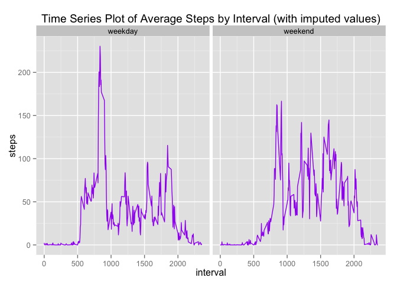

# Reproducible Research: Peer Assessment 1


#### STEP 1 - Loading and preprocessing the data

Prepare the environment, making sure required packages are loaded, working directory set, check and document session & enviroment is documented. Then download, unzip and read the data into a data frame.


```r
# Make sure needed packages loaded
req.pkg <- c("ggplot2","dplyr","lubridate")
pkgs.not.installed <- req.pkg[!sapply(req.pkg, function(p) require(p, character.only=T))]
```

```
## Loading required package: ggplot2
## Loading required package: dplyr
## 
## Attaching package: 'dplyr'
## 
## The following objects are masked from 'package:stats':
## 
##     filter, lag
## 
## The following objects are masked from 'package:base':
## 
##     intersect, setdiff, setequal, union
## 
## Loading required package: lubridate
```

```r
if (length(pkgs.not.installed)>0) install.packages(pkgs.not.installed, dependencies=TRUE)
# load required packages
library(ggplot2)
library(dplyr)
library(lubridate)
# document session info for reference 
sessionInfo()
```

```
## R version 3.2.0 (2015-04-16)
## Platform: x86_64-apple-darwin13.4.0 (64-bit)
## Running under: OS X 10.10.5 (Yosemite)
## 
## locale:
## [1] en_US.UTF-8/en_US.UTF-8/en_US.UTF-8/C/en_US.UTF-8/en_US.UTF-8
## 
## attached base packages:
## [1] stats     graphics  grDevices utils     datasets  methods   base     
## 
## other attached packages:
## [1] lubridate_1.3.3 dplyr_0.4.3     ggplot2_1.0.1  
## 
## loaded via a namespace (and not attached):
##  [1] Rcpp_0.12.1      knitr_1.10.5     magrittr_1.5     MASS_7.3-40     
##  [5] munsell_0.4.2    colorspace_1.2-6 R6_2.1.1         stringr_1.0.0   
##  [9] plyr_1.8.3       tools_3.2.0      parallel_3.2.0   grid_3.2.0      
## [13] gtable_0.1.2     DBI_0.3.1        htmltools_0.2.6  yaml_2.1.13     
## [17] digest_0.6.8     assertthat_0.1   reshape2_1.4.1   memoise_0.2.1   
## [21] evaluate_0.7     rmarkdown_0.6.1  stringi_0.5-5    scales_0.3.0    
## [25] proto_0.3-10
```

```r
# set working directory
setwd("~")
# create folder where the zip will be dobwloaded
if (!file.exists("data")) {
    dir.create("data")
}
## download and unzip file to if note already done
sourceUrl <- "http://d396qusza40orc.cloudfront.net/repdata%2Fdata%2Factivity.zip"
zipFile <- "./data/factivity.zip"  # file to be downloaded
# only download if zip file has not been downloaded before
if ( !file.exists(zipFile) ) {
    download.file(sourceUrl, zipFile)
}
# unzip the files (will do nothing if we previously did this)
filepaths <- unzip(zipFile,exdir = "./data")
# read data into data frame 
activity <- read.csv("./data/activity.csv")
```

#### Step 2 - What is mean total number of steps taken per day?

Create a new summary data frame of total number of steps taken each day. Create a histogram of steps taken each day. Use this data frame to calculate the mean and median.


```r
# create a new data frame of total number of steps taken each day
activity_by_day <- activity %>% select (date,steps) %>% 
        filter(!is.na(steps)) %>% 
             group_by (date) %>% 
                summarise(totalstepsperday= sum(steps))
# Make a histogram of the total number of steps taken each day
hist(activity_by_day$totalstepsperday,
     breaks=seq(0,25000,by=2500),
         ylim=c(0,20),
            col="purple",
                main="Histogram of total number of steps taken each day",
                    xlab="Steps",
                        ylab="Frequency",
                            border="black")
```

 

```r
# calculate mean and medium (ignore NAs)
mean(activity_by_day$totalstepsperday , na.rm = TRUE)
```

```
## [1] 10766.19
```

```r
median(activity_by_day$totalstepsperday , na.rm = TRUE)
```

```
## [1] 10765
```


#### STEP 3 - What is the average daily activity pattern?
Create a new summary data frame of mean number of steps taken each day. Create a histogram of steps taken each day. What is the average daily activity pattern


```r
activity_daily <- activity %>% select (interval,steps) %>% 
        filter(!is.na(steps)) %>% 
             group_by (interval) %>% 
                summarise(meandailysteps= mean(steps))
summary (activity_daily)
```

```
##     interval      meandailysteps   
##  Min.   :   0.0   Min.   :  0.000  
##  1st Qu.: 588.8   1st Qu.:  2.486  
##  Median :1177.5   Median : 34.113  
##  Mean   :1177.5   Mean   : 37.383  
##  3rd Qu.:1766.2   3rd Qu.: 52.835  
##  Max.   :2355.0   Max.   :206.170
```

```r
p <- ggplot(activity_daily, aes(x=interval, y=meandailysteps))
p + geom_line(color="purple") 
```

 

```r
# calculate which 5-minute interval, on average across all the days in the dataset, contains the maximum number of steps?
maxstepsinterval <- activity_daily %>% slice(which.max(meandailysteps))
```


#### Step 4 - Imputing missing values
To replace NA's use the mean of steps of each 5-minute interval. Create a new data frame which we have all NAs removed. This will be done by adding a new column of mean calculated previously using the 'interval' as key. Create histograms and calculate mean and median.


```r
# add mean daily interval column to activity df, then replace NA's with this value
activity.noNAs <- merge(activity,activity_daily,by="interval")
# round to nearest whole number
activity.noNAs$meandailysteps <- round(activity.noNAs$meandailysteps, digits = 0)
# replace NA's with mean of daily interval
activity.noNAs$steps <- ifelse(is.na(activity.noNAs$steps),activity.noNAs$meandailysteps,activity.noNAs$steps)
activity.noNAs$meandailysteps <- NULL # remove mean column, not needed
activity.noNAs_by_day <- activity.noNAs %>% select (date,steps) %>% 
        filter(!is.na(steps)) %>% 
             group_by (date) %>% 
                summarise(totalstepsperday= sum(steps))
hist(activity.noNAs_by_day$totalstepsperday,
     breaks=seq(0,25000,by=2500),
         ylim=c(0,20),
            col="purple",
                main="histogram of the total number of steps taken each day (w/o NAs)",
                    xlab="Steps",
                        ylab="Frequency",
                            border="black")
```

 

```r
# calculate mean and medium 
mean(activity.noNAs_by_day$totalstepsperday , na.rm = TRUE)
```

```
## [1] 10765.64
```

```r
median(activity.noNAs_by_day$totalstepsperday , na.rm = TRUE)
```

```
## [1] 10762
```


#### STEP 5 -Are there differences in activity patterns between weekdays and weekends?
To answer this question, first flag each observation as either a 'weekend' or 'weekday'. First compute the day of week when each  obeservation (row) was taken. A Saturday and Sunday observation is flagged as 'weekend', the rest 'weekday. Plot a separate time series graph for 'weekend' and 'weekday' 


```r
# create a new factor variable with two levels – “weekday” and “weekend”
activity.noNAs$date <- as.Date(activity.noNAs$date, format = "%Y-%m-%d") # convert date 
activity.noNAs$dayofweek <- weekdays(activity.noNAs$date) # compute day of week
activity.noNAs <- activity.noNAs %>% mutate(day = ifelse((dayofweek == "Sunday") | (dayofweek == "Saturday") ,"weekend","weekday")) # flag weekday or weekend
activity.noNAs$day <- as.factor(activity.noNAs$day)
activity.noNAs_daily <- activity.noNAs %>% select (interval,steps,day) %>% 
        filter(!is.na(steps)) %>% 
             group_by (interval,day) %>% 
                summarise(meandailysteps= mean(steps))
ggplot(activity.noNAs_daily,aes(interval,meandailysteps)) +
        ggtitle("Time Series Plot of Average Steps by Interval (with imputed values)") +
            facet_grid(. ~ day) +
            ylab("steps") +
                 geom_line(size = 0.5, color="purple")
```

 

