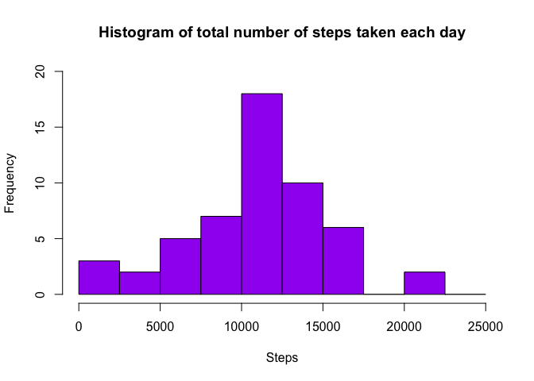

# Reproducible Research: Peer Assessment 1


## STEP 1 - Loading and preprocessing the data

plaintextplaintextplaintextplaintextplaintextplaintextplaintextplaintextplaintext
plaintextplaintextplaintextplaintextplaintextplaintextplaintextplaintextplaintext
plaintextplaintextplaintextplaintextplaintextplaintextplaintextplaintextplaintext


```r
# Always set working diractory to Home
setwd("~")
# Make sure needed packages loaded
req.pkg <- c("ggplot2","dplyr","lubridate")
pkgs.not.installed <- req.pkg[!sapply(req.pkg, function(p) require(p, character.only=T))]
```

```
## Loading required package: ggplot2
## Loading required package: dplyr
## 
## Attaching package: 'dplyr'
## 
## The following objects are masked from 'package:stats':
## 
##     filter, lag
## 
## The following objects are masked from 'package:base':
## 
##     intersect, setdiff, setequal, union
## 
## Loading required package: lubridate
```

```r
if (length(pkgs.not.installed)>0) install.packages(pkgs.not.installed, dependencies=TRUE)

library(ggplot2)
library(dplyr)
library(lubridate)

sessionInfo()
```

```
## R version 3.2.0 (2015-04-16)
## Platform: x86_64-apple-darwin13.4.0 (64-bit)
## Running under: OS X 10.10.5 (Yosemite)
## 
## locale:
## [1] en_US.UTF-8/en_US.UTF-8/en_US.UTF-8/C/en_US.UTF-8/en_US.UTF-8
## 
## attached base packages:
## [1] stats     graphics  grDevices utils     datasets  methods   base     
## 
## other attached packages:
## [1] lubridate_1.3.3 dplyr_0.4.3     ggplot2_1.0.1  
## 
## loaded via a namespace (and not attached):
##  [1] Rcpp_0.12.1      knitr_1.10.5     magrittr_1.5     MASS_7.3-40     
##  [5] munsell_0.4.2    colorspace_1.2-6 R6_2.1.1         stringr_1.0.0   
##  [9] plyr_1.8.3       tools_3.2.0      parallel_3.2.0   grid_3.2.0      
## [13] gtable_0.1.2     DBI_0.3.1        htmltools_0.2.6  yaml_2.1.13     
## [17] digest_0.6.8     assertthat_0.1   reshape2_1.4.1   memoise_0.2.1   
## [21] evaluate_0.7     rmarkdown_0.6.1  stringi_0.5-5    scales_0.3.0    
## [25] proto_0.3-10
```

```r
setwd("~")

if (!file.exists("data")) {
    dir.create("data")
}

## download and unzip file to ./data folder

## Download and load data
sourceUrl <- "http://d396qusza40orc.cloudfront.net/repdata%2Fdata%2Factivity.zip"
zipFile <- "./data/factivity.zip"  # file to be downloaded

# only download if zip file has not been downloaded before
if ( !file.exists(zipFile) ) {
    download.file(sourceUrl, zipFile)
}

# unzip the files (will do nothing if we previously did this)
filepaths <- unzip(zipFile,exdir = "./data")

activity <- read.csv("./data/activity.csv")
```

## What is mean total number of steps taken per day?


```r
activity_by_day <- activity %>% select (date,steps) %>% 
        filter(!is.na(steps)) %>% 
             group_by (date) %>% 
                summarise(totalstepsperday= sum(steps))

summary (activity_by_day)
```

```
##          date    totalstepsperday
##  2012-10-02: 1   Min.   :   41   
##  2012-10-03: 1   1st Qu.: 8841   
##  2012-10-04: 1   Median :10765   
##  2012-10-05: 1   Mean   :10766   
##  2012-10-06: 1   3rd Qu.:13294   
##  2012-10-07: 1   Max.   :21194   
##  (Other)   :47
```

```r
hist(activity_by_day$totalstepsperday,
     breaks=seq(0,25000,by=2500),
         ylim=c(0,20),
            col="blue",
                main="Histogram of daily steps",
                    xlab="Steps",
                        ylab="Frequency",
                            border="red")
```

 

```r
# g <- ggplot(activity_by_day,aes(x = totalstepsperday)) +
#   ggtitle("Histogram of daily steps") +
#   xlab("Steps (binwidth 2000)") +
#   scale_fill_brewer() +
#   geom_histogram(binwidth = 1000,fill="#3399FF",colour="black")
#g
```


## STEP 2 - What is the average daily activity pattern?
plaintextplaintextplaintextplaintextplaintextplaintextplaintextplaintextplaintext
plaintextplaintextplaintextplaintextplaintextplaintextplaintextplaintextplaintext


```r
activity_daily <- activity %>% select (interval,steps) %>% 
        filter(!is.na(steps)) %>% 
             group_by (interval) %>% 
                summarise(meandailysteps= mean(steps))

summary (activity_daily)
```

```
##     interval      meandailysteps   
##  Min.   :   0.0   Min.   :  0.000  
##  1st Qu.: 588.8   1st Qu.:  2.486  
##  Median :1177.5   Median : 34.113  
##  Mean   :1177.5   Mean   : 37.383  
##  3rd Qu.:1766.2   3rd Qu.: 52.835  
##  Max.   :2355.0   Max.   :206.170
```

```r
p <- ggplot(activity_daily, aes(x=interval, y=meandailysteps))
p + geom_line()
```

 

```r
# calculate which 5-minute interval, on average across all the days in the dataset, contains the maximum number of steps?
maxstepsinterval <- activity_daily %>% slice(which.max(meandailysteps))
```


## Imputing missing values
plaintextplaintextplaintextplaintextplaintextplaintextplaintextplaintextplaintext
plaintextplaintextplaintextplaintextplaintextplaintextplaintextplaintextplaintext
plaintextplaintextplaintextplaintextplaintextplaintextplaintextplaintextplaintext


```r
# add mean daily interval column to activity df, then replace NA's with this value
activity <- merge(activity,activity_daily,by="interval")
# round to nearest whole number
activity$meandailysteps <- round(activity$meandailysteps, digits = 0)
# replace NA's with mean of daily interval
activity$steps <- ifelse(is.na(activity$steps),activity$meandailysteps,activity$steps)
```


## STEP 3 -Are there differences in activity patterns between weekdays and weekends?
plaintextplaintextplaintextplaintextplaintextplaintextplaintextplaintextplaintext
plaintextplaintextplaintextplaintextplaintextplaintextplaintextplaintextplaintext
plaintextplaintextplaintextplaintextplaintextplaintextplaintextplaintextplaintext
